# q34_计算机网络

## 📋 题目要求 (题面)

使用两种编码方案对比特流 01100111 进行编码的结果如下图所示，编码 1 和编码 2 分别是（ ）。

- **A.** NRZ 和曼彻斯特编码
- **B.** NRZ 和差分曼彻斯特编码
- **C.** NRZI 和曼彻斯特编码
- **D.** NRZI 和差分曼彻斯特编码

---

## 💡 答案与深度解析

**【正确答案】**：`A`

**正确答案：A**
NRZ 是最简单的串行编码技术，用两个电压来代表两个二进制数，如高电平表示 1，低电平表示 0，题中编码 1 符合。NRZI 则是用电平的一次翻转来表示 1，与前一个 NRZI 电平相同的电平表示 0。曼彻斯特编码将一个码元分成两个相等的间隔，前一个间隔为低电平后一个间隔为高电平表示 1；0 的表示正好相反，题中编码 2 符合。
