# q41_数据结构

## 📋 题目要求 (题面)

用单链表保存
 $m$
 个整数，结点的结构为，且
 $∣data∣\le n$
 （
 $n$
 为正整数）。现要求设计一个时间复杂度尽可能高效的算法，对于链表中 data 的绝对值相等的结点，仅保留第一次出现的结点而删除其余绝对值相等的结点。例如，若给定的单链表 head 如下：

则删除结点后的 head 为：

要求：

(1) 给出算法的基本设计思想。

(2) 使用 C 或 C++ 语言，给出单链表结点的数据类型定义。

(3) 根据设计思想，采用 C 或 C++ 语言描述算法，关键之处给出注释。

(4) 说明你所设计算法的时间复杂度和空间复杂度。







---

## 💡 答案与深度解析

1）算法的基本设计思想

算法的核心思想是用空间换时间。使用辅助数组记录链表中已出现的数值，从而只需对链表进行一趟扫描。

因为
 $∣data∣\le n$
，故辅助数组
 $q$
的大小为
 $n+1$
，各元素的初值均为 0。依次扫描链表中的各
结点，同时检查
 $q[∣data∣]$
的值，如果为
 $0$
，则保留该结点，并令
 $q[data]=1$
；否则，将该结点从
链表中删除。

2）使用 C 语言描述的单链表结点的数据结构定义：

3）算法实现

```c
void RemoveElements(ListNode *head, int n) {
  // 数组充当哈希表
  int hash[n+1];
  for (int i = 0; i <= n; i++) {
    // 0 表示没有命中
    hash[i] = 0;
  }
  // 当遍历的结点
  ListNode *q = head->link;
  // 先前的结点
  ListNode *p = head;
  while (q != NULL) {
    // 绝对值已经出现过
    if (hash[abs(q->data)] == 1) {
      // 删除该节点
      p->next = q->next;
      q = p->next;
    } else {
      // 设置哈希表
      hash[abs(q->data)] = 1;
      q = q->next;
      p = p->next;
    }
  }
}
```
