# q43_计算机组成原理

## 📋 题目要求 (题面)

某 16 位计算机的主存按字节编址，存取单位为 16 位；采用 16 位定长指令字格式；CPU 采用单总线结构，主要部分如下图所示。

图中 R0～R3 为通用寄存器；T 为暂存器；SR 为移位寄存器，可实现直送（mov）、左移一位（left）和右移一位（right）3 种操作，控制信号为 SRop，SR 的输出由信号 SRout 控制；ALU 可实现直送 A（mova）、A 加 B（add）、A 减 B（sub）、A 与 B（and）、A 或 B（or）、非 A（not）、A 加 1（inc）这 7 种操作，控制信号为 ALUop。

注：已补充内总线到 MAR 的箭头和内总线到 IR 的箭头。

请回答下列问题。

(1) 图中哪些寄存器是程序员可见的？为何要设置暂存器 T？

(2) 控制信号 ALUop 和 SRop 的位数至少各是多少？

(3) 控制信号 SRout 所控制部件的名称或作用是什么？

(4) 端点①～⑨中，哪些端点须连接到控制部件的输出端？

(5) 为完善单总线数据通路，需要在端点①～⑨中相应的端点之间添加必要的连线。写出连线的起点和终点，以正确表示数据的流动方向。

(6) 为什么二路选择器 MUX 的一个输入端是 2？

---

## 💡 答案与深度解析

1）程序员可见寄存器为通用寄存器（R0~R3）和 PC。因为采用了单总线结构，因此，若无暂存器 T，则 ALU 的 A、B 端口会同时获得两个相同的数据，使数据通路不能正常工作。

【评分说明】回答通用寄存器（R0~R3），给分；回答 PC，给分；部分正确，酌情给分。设置暂存器 T 的原因若回答用于暂时存放端口 A 的数据，则给分；其他答案，酌情给分。

2）ALU 共有 7 种操作，故其操作控制信号 ALUop 至少需要 3 位；移位寄存器有 3 种操作，其操作控制信号 SRop 至少需要 2 位。

3）信号 SRout 所控制的部件是一个三态门，用于控制移位器与总线之间数据通路的连接与断开。

【评分说明】只要回答出三态门或者控制连接/断开，即给分。

4）端口 ①、②、③、⑤、⑧ 须连接到控制部件输出端。

【评分说明】答案包含④、⑥、⑦、⑨中任意一个，不给分；答案不全酌情给分。

5）连线 1，⑥→⑨：连线 2，⑦→④。

【评分说明】回答除上述连线以外的其他连线，酌情给分。

6）因为每条指令的长度为 16 位，按字节编址，所以每条指令占用 2 个内存单元，顺序执行时，下条指令地址为 (PC)+2。MUX 的一个输入端为 2，可便于执行 (PC)+2 操作。
