# q44_计算机组成原理

## 📋 题目要求 (题面)

题 43 中描述的计算机，其部分指令执行过程的控制信号如题 44 图 a 所示。

该机指令格式如题 44 图 b 所示，支持寄存器直接和寄存器间接两种寻址方式，寻址方式位分别为 0 和 1，通用寄存器 R0～R3 的编号分别为 0、1、2 和 3。

请回答下列问题。

(1) 该机的指令系统最多可定义多少条指令？

(2) 假定 inc、shl 和 sub 指令的操作码分别为 01H、02H 和 03H，则以下指令对应的机器代码各是什么？

```c
inc R1;             // (R1)+1→R1
shl R2, R1;         // (R1)<<1→R2
sub R3, (R1), R2;   // ((R1))–(R2)→R3
```

(3) 假设寄存器 X 的输入和输出控制信号分别为 Xin 和 Xout，其值为 1 表示有效，为 0 表示无效（例如，PCout=1 表示 PC 内容送总线）；存储器控制信号为 MEMop，用于控制存储器的读 (read) 和写 (write) 操作。写出题 44 图 a 中标号①～⑧处的控制信号或控制信号的取值。

(4) 指令 `sub R1，R3，(R2)` 和 `inc R1` 的执行阶段至少各需要多少个时钟周期？





---

## 💡 答案与深度解析

1）指令操作码有 7 位，因此最多可定义
 $27$ =128
条指令。

2）各条指令的机器代码分别如下：

①“incR1”的机器码为 0000001001000000，即 0240H。

②“shlR2,R1”的机器码为 0000010010001000，即 0488H。

③“subR3,(R1),R2”的机器码为 0000011011101010，即 06EAH。

3）各标号处的控制信号或控制信号取值如下：
①0；②mov；③mova；④left；⑤read；⑥sub；⑦mov；⑧Srout

【评分说明】答对两个给分。

4）指令 `subR1, R3, (R2)` 的执行阶段至少包含 4 个时钟周期；指令 `incR1` 的执行阶段至少包含 2 个时钟周期。
