# q01_数据结构

## 📋 题目要求 (题面)

已知表头元素为 c 的单链表在内存中的存储状态如下表所示。现将 f 存放于 1014H 处并插入单链表，若 f 在逻辑上位于 a 和 e 之间，则 a,e,f 的 “链接地址” 依次是（ ）。

- **A.** 1010H，1014H，1004H
- **B.** 1010H，1004H，1014H
- **C.** 1014H，1010H，1004H
- **D.** 1014H，1004H，1010H

---

## 💡 答案与深度解析

**【正确答案】**：`D`

**正确答案：D**

根据存储状态，单链表的结构如下图所示。

c
