# q03_数据结构

## 📋 题目要求 (题面)

设有下图所示的火车车轨，入口到出口之间有 n 条轨道，列车的行进方向均为从左至右，列车可驶入任意一条轨道。现有编号为 1-9 的 9 列列车，驶入的次序依次是 8, 4, 2, 5, 3, 9, 1, 6, 7。若期望驶出的次序依次为 1~9，则 n 至少是（ ）。

- **A.** 2
- **B.** 3
- **C.** 4
- **D.** 5

---

## 💡 答案与深度解析

**【正确答案】**：`C`

**正确答案：C**
在确保队列先进先出原则的前提下。根据题意具体分析：入队顺序为 8, 4, 2, 5, 3, 9, 1, 6, 7，出队顺序为 1~9。入口和出口之间有多个队列（n 条轨道），且每个队列（轨道）可容纳多个元素（多列列车）。如此分析：显然先入队的元素必须小千后入队的元素（如果 8 和 4 入同一队列，8 在前 4 在后，那么出队时只能是 8 在前 4 在后），这样 8 入队列 1，4 入队列 2, 2 入队列 3，5 入队列 2（按照前面的原则“大的元素在小的元素后面”也可以将 5 入队列 3，但这时剩下的元素 3 就必须放到一个新的队列里面，无法确保”至少“，本应该是将 5 入队列 2，再将 3 入队列 3，不增加新队列的情况下，可以满足题意“至少”的要求），3 入队列 3，9 入队列 1，这时共占了 3 个队列，后面还有元素 1，直接再占用一个新的队列 4，1 从队列 4 出队后，剩下的元素 6 和 7 或者入队到队列 2 或者入队到队列 3（为简单起见我们不妨设 n 个队列的序号分别为 1, 2, …, n），这样就可以满足题目的要求。综上，共占用了 4 个队列。当然还有其他的入队出队的情况，请考生们自己推演。但要确保满足：O 队列中后面的元素大千前面的元素；@确保占用最少（即
满足题目中的“至少") 的队列。
