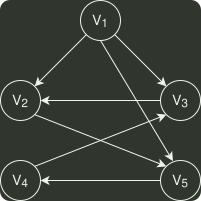

# q06_数据结构

## 📋 题目要求 (题面)

下列选项中，不是下图深度优先搜索序列的是（）

- **A.** $V_{1}$
- **B.** $V_{1}$
- **C.** $V_{1}$
- **D.** $V_{1}$

---

## 💡 答案与深度解析

**【正确答案】**：`D`

**正确答案：D**
对于本题，只需按深度优先遍历的策略进行遍历即可。对千选项 A: 先访问
 $V_{1}$
, 然后访问
与
 $V_{1}$
邻接且未被访问的任一顶点（满足的有
 $V_{2}$
、
 $V_{3}$
和
 $V_{5}$
）, 此时访问
 $V_{5}$
, 然后从
 $V_{5}$
出发，访
问与
 $V_{5}$
邻接且未被访问的任一顶点（满足的只有
 $V_{4}$
）, 然后从
 $V_{4}$
出发，访问与
 $V_{4}$
邻接且未被
访问的任一顶点（满足的只有
 $V_{3}$
），然后从
 $V_{3}$
出发，访问与
 $V_{3}$
邻接且未被访问的任一顶点（满足的只有
 $V_{2}$
）, 结束遍历。选项 B 和 C 的分析方法与选项 A 相同，不再赘述。对千选项 D, 首
先访问
 $V_{1}$
, 然后从
 $V_{1}$
出发，访问与
 $V_{1}$
邻接且未被访问的任一顶点（满足的有
 $V_{2}$
、
 $V_{3}$
和
 $V_{5}$
）,
然后从
 $V_{2}$
出发，访问与
 $V_{2}$
邻接且未被访问的任一顶点（满足的只有
 $V_{5}$
）, 按规则本应该访问
 $V_{5}$
, 但选项 D 却访问
 $V_{3}$
, 因此 D 错误。
