# q08_数据结构

## 📋 题目要求 (题面)

使用迪杰斯特拉（Djkstra）算法求下图中从顶点 1 到其他各顶点的最短路径，依次得到的各最短路径的目标顶点是（ ）。

- **A.** $5,2,3,4,6$
- **B.** $5,2,3,6,4$
- **C.** $5,2,4,3,6$
- **D.** $5,2,6,3,4$

---

## 💡 答案与深度解析

**【正确答案】**：`B`

**正确答案：B**

根据 Dijkstra 算法，从顶点 1 到其余各顶点的最短路径如下表所示。

| 顶点 | 第 1 趟 | 第 2 趟 | 第 3 趟 | 第 4 趟 | 第 5 趟 |
| --- | --- | --- | --- | --- | --- |
| 2 | 5 $v_{1}$ →v2 | 5 $v_{1}$ →v2 |  |  |  |
| 3 | $∞$ | $∞$ | 7 $v_{1}$ →v2→v3 |  |  |
| 4 | $∞$ | 11 $v_{1}$ →v5→v4 | 11 $v_{1}$ →v5→v4 | $11 v_{1}$ →v5→v4 | 11 $v_{1}$ →v5→v4 |
| 5 | 4 $v_{1}$ →v5 |  |  |  |  |
| 6 | $∞$ | 9 $v_{1}$ →v5→v6 | 9 $v_{1}$ →v5→v6 | 9 $v_{1}$ →v5→v6 |  |
| 集合 S | {1, 5} | {1, 5, 2} | {1, 5, 2, 3} | {1, 5, 2, 3, 6} | {1, 5, 2, 3, 6, 4} |
