# q32_操作系统

## 📋 题目要求 (题面)

下列关于管程的叙述中，错误的是（ ）。

- **A.** 管程只能用于实现进程的互斥
- **B.** 管程是由编程语言支持的进程同步机制
- **C.** 任何时候只能有一个进程在管程中执行
- **D.** 管程中定义的变量只能被管程内的过程访问

---

## 💡 答案与深度解析

**【正确答案】**：`A`

**正确答案：A**
管程 是由一组数据以及定义在这组数据之上的对这组数据的操作组成的软件模块，这组操作能初始化并改变管程中的数据和同步进程。管程不仅能实现进程间的互斥，而且能实现进程间的同步，故 A 错误、B 正确。管程具有特性：①局部于管程的数据只能被局部于管程内的过程所访问；②一个进程只有通过调用管程内的过程才能进入管程访问共享数据；③每次仅允许一个进程在管程内执行某个内部过程，故 C 和 D 正确。
