# q44_计算机组成原理

## 📋 题目要求 (题面)

假定 CPU 主频为 50MHz，CPI 为 4。设备 D 采用异步串行通信方式向主机传送 7 位 ASCII 字符，通信规程中有 1 位奇校验位和 1 位停止位，从 D 接收启动命令到字符送入 I/O 端口需要 0.5ms。请回答下列问题，要求说明理由。

(1) 每传送一个字符，在异步串行通信线上共需传输多少位？在设备 D 持续工作过程中，每秒钟最多可向 I/O 端口送入多少个字符？

(2) 设备 D 采用中断方式进行输入/输出，示意图如下∶

I/O 端口每收到一个字符申请一次中断，中断响应需 10 个时钟周期，中断服务程序共有 20 条指令，其中第 15 条指令启动 D 工作。若 CPU 需从 D 读取 1000 个字符，则完成这一任务所需时间大约是多少个时钟周期？CPU 用于完成这一任务的时间大约是多少个时钟周期？在中断响应阶段 CPU 进行了哪些操作？

---

## 💡 答案与深度解析

1）每传送一个 ASCII 字符，需要传输的位数有 1 位起始位、7 位数据位（ASCII 字符占 7 位）、1 位奇校验位和 1 位停止位，故总位数为 1 + 7 + 1 + 1 = 10。（2 分）I/O 端口每秒钟最多可接收 1000/0.5 = 2000 个字符。（1 分）

【评分说明】对于第一问，若考生回答总位数为 9，则给 1 分。

2）一个字符传送时间包括：设备 D 将字符送/O 端口的时间、中断响应时间和中断服务程序前 15 条指令的执行时间。时钟周期为 1/(50MHz)=20ns，设备 D 将字符送 I/O 端口的时间为 0.5ms/20ns=2.5×10⁴ 个时钟周期。一个字符的传送时间大约为 2.5×10⁴+10+15×4=25070 个时钟周期。完成 1000 个字符传送所需时间大约为 1000×25070=25070000 个时钟周期。（3 分）

CPU 用于该任务的时间大约为 1000×(10+20×4)=9×10⁴ 个时钟周期。（1 分）

在中断响应阶段，CPU 主要进行以下操作：关中断、保护断点和程序状态、识别中断源。（2 分）

【评分说明】

①位于第一问，若答案是 25070020，则同样给分；若答案是 25000000 或 25000020，则给 2 分。如果没有给出分布计算步骤，但算式和结果正确，同样给分。

②对于第三问，只要回答关中断和保护断点，就给 2 分，其他答案酌情给分。
