# q45_操作系统

## 📋 题目要求 (题面)

某计算机采用页式虚拟存储管理方式，按字节编址，虚拟地址为 32 位，物理地址为 24 位，页大小为 8KB；TLB 采用全相联映射；Cache 数据区大小为 64KB，按 2 路组相联方式组织，主存块大小为 64B。存储访问过程的示意图如下。

请回答下列问题。

(1) 图中字段 A～G 的位数各是多少？TLB 标记字段 B 中存放的是什么信息？

(2) 将块号为 4099 的主存块装入到 Cache 中时，所映射的 Cache 组号是多少？对应的 H 字段内容是什么？

(3) Cache 缺失处理的时间开销大还是缺页处理的时间开销大？为什么？

(4) 为什么 Cache 可以采用直写 (Write Through) 策略，而修改页面内容时总是采用回写 (Write Back) 策略？

---

## 💡 答案与深度解析

1）页大小为 8KB，页内偏移地址为 13 位，故 A = B = 32-13 = 19；D = 13；C = 24-13 = 11；主存块大小为 64B，故 G = 6。
2 路组相联，每组数据区容量有 64B×2 = 128B，共有 64KB/128B = 512 组，故 F = 9；E = 24-G-F = 24-6-9 = 9。

因而 A=19，B=19，C=11，D=13，E=9，F=9，G=6。（各 1 分，共 7 分）

TLB 中标记字段 B 的内容是虚页号，表示该 TLB 项对应哪个虚页的页表项。（1 分）

2）块号 4099=000001000000000011B，因此，所映射的 Cache 组号为 000000011B=3，（1 分）对应的 H 字段内容为 000001000B。（1 分）

3）Cache 缺失带来的开销小，而处理缺页的开销大。（1 分）因为缺页处理需要访问磁盘，而 Cache 缺失只要访问主存。（1 分）

【评分说明】对于 (3) 中第 2 问，若考生回答因为缺页需要软件实现而 Cache 缺失用硬件实现，则同样给分。

4）因为采用 直写法 时需要同时写快速存储器和慢速存储器，而写磁盘比写主存慢很多，所以，在 Cache-主存层次，Cache 可以采用直写策略，而在主存 - 外存（磁盘）层次，修改页面内容时总是采用 回写法。（2 分）
