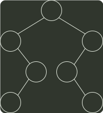

# q05_数据结构

## 📋 题目要求 (题面)

已知一颗二叉树的树形如下图所示，其后序序列为 e，a，c，b，d，g，f，树中与结点 a 同层的结点是（）

- **A.** c
- **B.** d
- **C.** f
- **D.** g

---

## 💡 答案与深度解析

**【正确答案】**：`B`

**正确答案：B**
后序序列是先左子树，接着右子树，最后父结点，递归进行。根结点左子树的叶结点首先被访问，它是 e。接下来是它的父结点 a, 然后是 a 的父结点 c。接着访问根结点的右子树。它的叶结点 b 首先被访问，然后是 b 的父结点 d, 再者是 d 的父结点 g。最后是根结点 f。因此 d 与 a 同层，B 正确。
