# q08_数据结构

## 📋 题目要求 (题面)

下列二叉树中，可能成为折半查找判定树（不含外部结点）的是（）

- **A**
- **B**
- **C**
- **D**

---

## 💡 答案与深度解析

**【正确答案】**：`A`

**正确答案：A**

折半查找判定树 实际上是一棵 二叉排序树，它的中序序列是一个有序序列。可以在树结点上依次填上相应的元素，判断哪颗树符合折半查找的规则。

5
