# q41_数据结构

## 📋 题目要求 (题面)

请设计一个算法，将给定的表达式树（二叉树）转换为等价的中缀表达式（通过括号反映操作符的计算次序）并输出。例如，当下列两棵表达式树作为算法输入时：

输出的中缀表达式分别为 `(a+b)*(c*(`−`d))` 和 `(a*b)+(`−`(c`−`d))` 。

二叉树结点的定义如下：

```c
typedef struct node{
    char data[10];   // 存储操作数或操作符
    struct node *left, *right;
} BTree;
```

要求：

(1) 给出算法的基本设计思想。

(2) 根据设计思想，采用 C 或 C++ 语言描述算法，关键之处给出注释。




---

## 💡 答案与深度解析

1）算法的基本设计思想

表达式树的中序序列加上必要的括号即为等价的中缀表达式。可以基于二叉树的中序遍历策略得到所需的表达式。（3 分）

表达式树中分支结点所对应的子表达式的计算次序，由该分支结点所处的位置决定。为得到正确的中缀表达式，需要在生成遍历序列的同时，在适当位置增加必要的括号。显然，表达式的最外层（对应根结点）及操作数（对应叶结点）不需要添加括号。（2 分）

2）算法实现（10 分）

```c
void preorder(node *root, int depth) {
  if (!root) {
    return;
  }
  bool isRoot = (depth == 1);
  bool isLeaf = (!root->left && !root->right);
  if (!isRoot && !isLeaf) {
    printf(&#34;(&#34;);
  }
  preorder(root->left, depth+1);
  printf(&#34;%s&#34;, root->data);
  preorder(root->right, depth+1);
  if (!isRoot && !isLeaf) {
    printf(&#34;)&#34;);
  }
}

void solve(node *root) {
  preorder(root, 1);
}
```
