# q42_数据结构

## 📋 题目要求 (题面)

使用 Prim（普里姆）算法求带权连通图的最小（代价）生成树（MST）。请回答下列问题。

(1) 对下列图 G，从顶点 A 开始求 G 的 MST，依次给出按算法选出的边。

(2) 图 G 的 MST 是唯一的吗？

(3) 对任意的带权连通图，满足什么条件时，其 MST 是唯一的？

---

## 💡 答案与深度解析

1）Prim 算法 属于贪心策略。算法从一个任意的顶点开始，一直长大到覆盖图中所有顶点为止。算法每一步在连接树集合 S 中顶点和其他顶点的边中，选择一条使得树的总权重增加最小的边加入集合 S。当算法终止时，S 就是最小生成树。

S 中顶点为 A，候选边为 (A,D),(A,B),(A,E)，选择 (A,D) 加入 S。S 中顶点为 A,D，候选边为 (A,B),(A,E),(D,E),(C,D)，选择 (D,E) 加入 S。S 中顶点为 A,D,E，候选边为 (A,B),(C,D),(C,E)，选择 (C,E) 加入 S。S 中顶点为 A,D,E,C，候选边为 (A,B),(B,C)，选择 (B,C) 加入 S。S 就是最小生成树。

依次选出的边为 (A,D),(D,E),(C,E),(B,C)（4 分）

【评分说明】每正确选对一条边且次序正确，给 1 分。若考生选择的边正确，但次序不完
全正确，酌情给分。

2）图 G 的 MST 是唯一的。（2 分）第一小题的最小生成树包括了图中权值最小的四条边，其他边都比这四条边大，所以此图的 MST 唯一。

3）当带权连通图的任意一个环中所包含的边的权值均不相同时，其 MST 是唯一的。（2 分）此题不要求回答充分必要条件，所以回答一个限制边权值的充分条件即可。

【评分说明】①若考生答案中给出的是其他充分条件，例如“带权连通图的所有边的权值均不相同”，同样给分。

②若考生给出的充分条件对图的顶点数和边数做了某些限制，例如，限制了图中顶点的个数（顶点个数少于 3 个）、限制了图的形状（图中没有环）等，则最高给 1 分。

③答案部分正确，酌情给分。
