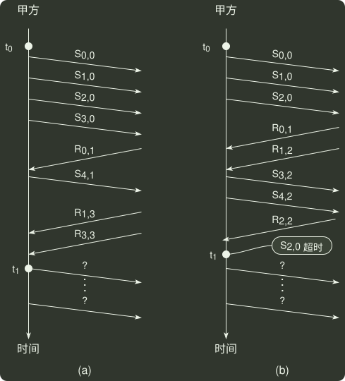

# q47_计算机网络

## 📋 题目要求 (题面)

甲乙双方均采用后退 N 帧协议 (GBN) 进行持续的双向数据传输，且双方始终采用捎带确认，帧长均为 1000 B。
 $Sx,y$
 和
 $Rx,y$
 分别表示甲方和乙方发送的数据帧，其中：
 $x$
是发送序号；
 $y$
是确认序号（表示希望接收对方的下一帧序号）；数据帧的发送序号和确认序号字段均为 3 比特。信道传输速率为 100 Mbps，RTT = 0.96 ms。下图给出了甲方发送数据帧和接收数据帧的两种场景，其中
 $t_{0}$
 为初始时刻，此时甲方的发送和确认序号均为 0，
 $t_{1}$
 时刻甲方有足够多的数据待发送。

请回答下列问题。

(1) 对于图 (a)，
 $t_{0}$
 时刻到
 $t_{1}$
 时刻期间，甲方可以断定乙方已正确接收的数据帧数是多少？正确接收的是哪几个帧（请用
 $Sx,y$
 形式给出）？

(2) 对于图 (a)，从
 $t_{1}$
 时刻起，甲方在不出现超时且未收到乙方新的数据帧之前，最多还可以发送多少个数据帧？其中第一个帧和最后一个帧分别是哪个（请用
 $Sx,y$
 形式给出）？

(3) 对于图 (b)，从
 $t_{1}$
 时刻起，甲方在不出现新的超时且未收到乙方新的数据帧之前，需要重发多少个数据帧？重发的第一个帧是哪个（请用
 $Sx,y$
 形式给出）？

(4) 甲方可以达到的最大信道利用率是多少？

---

## 💡 答案与深度解析

1）6 时刻到 t 时刻期间，甲方可以断定乙方已正确接收了 3 个数据帧，（1 分）分别是
 $S_{0,0}$
,
 $S_{1,0}$
,
 $S_{2,0}$
（1 分）。
 $R_{3,3}$
说明乙发送的数据帧确认号是 3，即希望甲发送序号 3 的数据帧，说明乙已经接收了序号为 0~2 的数据帧。

2）从
 $t_{1}$
时刻起，甲方最多还可以发送 5 个数据帧（1 分），其中第一个帧是
 $S_{5,2}$
（1 分），最后一个数据帧是
 $S_{1,2}$
（1 分）。发送序号 3 位，有 8 个序号。在 GBN 协议中，序号个数 ≥ 发送窗口 + 1，所以这里发送窗口最大为 7。此时已发送了
 $S_{3,0}$
和
 $S_{4,1}$
，所以最多还可以发送 5 个帧。

3）甲方需要重发 3 个数据帧（1 分），重发的第一个帧是
 $S_{2,3}$
（1 分）。在 GBN 协议中，接收方发送了 N 帧后，检测出错，则需要发送出错帧及其之后的帧。
 $S_{2,0}$
超时，所以重发的第一帧是
 $S_{2}$
。已收到乙的
 $R_{2}$
帧，所以确认号应为 3。

\[
\frac{7 \times \frac{8 \times 1000}{100 \times 10^6}}{0.96 \times 10^{-3} + 2 \times \frac{8 \times 1000}{100 \times 10^6}} \times 100\% = 50%
\]

4）甲方可以达到的最大信道利用率是

 $U$
= 发送数据的时间/从开始发送第一帧到收到第一个确认帧的时间 =
 $N⋅Td/(Td+RTT+Ta)$

 $U$
是信道利用率，
 $N$
是发送窗口的最大值，
 $Td$
是发送一数据帧的时间，
 $RTT$
是往返时间，
 $Ta$
是发送一确认帧的时间。这里采用捎带确认，
 $Td=Ta$
。

【评分说明】答案部分正确，酌情给分。
