# q05_数据结构

## 📋 题目要求 (题面)

已知字符集{a, b, c, d, e, f}，若各字符出现的次数分别为 6, 3, 8, 2, 10, 4，则对应字符集中各字符的哈夫曼编码可能是（ ）。

- **A.** 00, 1011, 01, 1010, 11, 100
- **B.** 00, 100, 110, 000, 0010, 01
- **C.** 10, 1011, 11, 0011, 00, 010
- **D.** 0011, 10, 11, 0010, 01, 000

---

## 💡 答案与深度解析

**【正确答案】**：`A`

**正确答案：A**

构造一棵符合题意的哈夫曼树，如下图所示。

33
