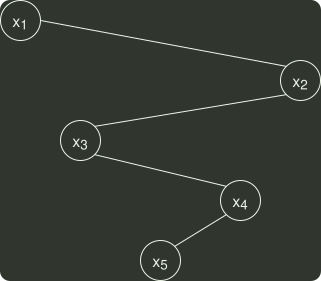

# q06_数据结构

## 📋 题目要求 (题面)

已知二叉排序树如下图所示，元素之间应满足的大小关系是（ ）。

- **A.** $x_{1}$
- **B.** $x_{1}$
- **C.** $x_{3}$
- **D.** $x_{4}$

---

## 💡 答案与深度解析

**【正确答案】**：`C`

**正确答案：C**
根据 二叉排序树 的特性：中序遍历（LNR）得到的是一个递增序列。图中二叉排序树的中序遍历序列为
 $xi$ ,x3,x5,x4,x2
, 可知
 $x_{3}$ <x5<x4
。
