# q07_数据结构

## 📋 题目要求 (题面)

下列选项中，不是如下有向图的拓扑序列的是（ ）

- **A.** 1, 5, 2, 3, 6, 4
- **B.** 5, 1, 2, 6, 3, 4
- **C.** 5, 1, 2, 3, 6, 4
- **D.** 5, 2, 1, 6, 3, 4

---

## 💡 答案与深度解析

**【正确答案】**：`D`

**正确答案：D**
拓扑排序 每次选取入度为 0 的结点输出，经观察不难发现拓扑序列前两位一定是 1,5 或 5,1（因为只有 1 和 5 的入度均为 0，且其他结点都不满足仅有 1 或仅有 5 作为前驱）。因此 D 显然错误。
