# q11_计算机组成原理

## 📋 题目要求 (题面)

在将数据序列 (6, 1, 5, 9, 8, 4, 7) 建成大根堆时，正确的序列变化过程是（）。

- **A.** 6,1,7,9,8,4,5 → 6,9,7,1,8,4,5 → 9,6,7,1,8,4,5 → 9,8,7,1,6,4,5
- **B.** 6,9,5,1,8,4,7 → 6,9,7,1,8,4,5 → 9,6,7,1,8,4,5 → 9,8,7,1,6,4,5
- **C.** 6,9,5,1,8,4,7 → 9,6,5,1,8,4,7 → 9,6,7,1,8,4,5 → 9,8,7,1,6,4,5
- **D.** 6,1,7,9,8,4,5 → 7,1,6,9,8,4,5 → 7,9,6,1,8,4,5 → 9,7,6,1,8,4,5 → 9,8,6,1,7,4,5

---

## 💡 答案与深度解析

**【正确答案】**：`A`

**正确答案：A**

参考构造初始堆，该题的堆变化过程如下图所示：

6
