# q37_计算机网络

## 📋 题目要求 (题面)

路由器 R 通过以太网交换机 S1 和 S2 连接两个网络，R 的接口、主机 H1 和 H2 的 IP 地址与 MAC 地址如下图所示。若 H1 向 H2 发送一个 IP 分组 P，则 H1 发出的封装 P 的以太网帧的目的 MAC 地址、H2 收到的封装 P 的以太网帧的源 MAC 地址分别是（ ）。

- **A.** 00-a1-b2-c3-d4-62、00-1a-2b-3c-4d-52
- **B.** 00-a1-b2-c3-d4-62、00-1a-2b-3c-4d-61
- **C.** 00-1a-2b-3c-4d-51、00-1a-2b-3c-4d-52
- **D.** 00-1a-2b-3c-4d-51、00-a1-b2-c3-d4-61

---

## 💡 答案与深度解析

**【正确答案】**：`D`

**正确答案：D**
在网络的信息传递中，会经常用到两个地址：MAC 地址和 IP 地址。其中，MAC 地址会随着信息被发往不同的网络而改变，但 IP 地址当且仅当信息在私人网络中传递时才会改变。分组 P 在如题图所示的网络中传递时，首先由主机 H1 将分组发往路由器 R，此时源 MAC 地址为 1 主机本身的 MAC 地址，即 00-1a-2b-3c-4d-52，目的 MAC 地址 为路由器 R 的 MAC 地址，即 00-1a-2b-3c-4d-51。当路由器 R 收到分组 P 后，根据分组 P 的目的 IP 地址，得知应将分组从另一个端口转发出去，于是会给分组 P 更换新的 MAC 地址，此时由于从另外的端口转发出去，因此 P 的新源 MAC 地址变为负责转发的端口 MAC 地址，即 00-a1-b2-c3-d4-61, 目的 MAC 地址应为主机 H2 的 MAC 地址，即 00-a1-b2-c3-d4-62。根据分析过程，题目所问的 MAC 地址应为路由器 R 两个端口的 MAC 地址，故选 D。
