# q38_计算机网络

## 📋 题目要求 (题面)

某路由表中有转发接口相同的 4 条路由表项，其目的网络地址分别是 35.230.32.0/21、35.230.40.0/21、35.230.48.0/21 和 35.230.56.0/21，将该 4 条路由聚合后的目的网络地址为（ ）。

- **A.** 35.230.0.0/19
- **B.** 35.230.0.0/20
- **C.** 35.230.32.0/19
- **D.** 35.230.32.0/20

---

## 💡 答案与深度解析

**【正确答案】**：`C`

**正确答案：C**

对于此类题目，先分析需要聚合的 IP 地址。观察发现，题中的 4 个路由地址，前 16 位完全相同，不同之处在于第 3 段的 8 位中，将这 8 位展开写成二进制，分别如下：

7
