# q42_数据结构

## 📋 题目要求 (题面)

拟建设一个光通信骨干网络连通 BJ、CS、XA、QD、JN、NJ、TL 和 WH 等 8 个城市，题 42 图中无向边上的权值表示两个城市间备选光缆的铺设费用。

请回答下列问题。

(1) 仅从铺设费用角度出发，给出所有可能的最经济的光缆铺设方案（用带权图表示），并计算相应方案的总费用。

(2) 题 42 图可采用图的哪一种存储结构？给出求解问题 (1) 所使用的算法名称。

(3) 假设每个城市采用一个路由器按 (1) 中得到的最经济方案组网，主机 H1 直接连接在 TL 的路由器上，主机 H2 直接连接在 BJ 的路由器上。若 H1 向 H2 发送一个 TTL=5 的 IP 分组，则 H2 是否可以收到该 IP 分组？

---

## 💡 答案与深度解析

1）为了求解最经济的方案，可以把问题抽象为求无向带权图的最小生成树。可以采用手动 Prim 算法或 Kruskal 算法作图。注意本题最小生成树有两种构造，如下图所示。

XA
