# q44_计算机组成原理

## 📋 题目要求 (题面)

某计算机采用页式虚拟存储管理方式，按字节编址。CPU 进行存储访问的过程如题 44 图所示。

根据题 44 图回答下列问题。

(1) 主存物理地址占多少位？

(2) TLB 采用什么映射方式？TLB 用 SRAM 还是 DRAM 实现？

(3) Cache 采用什么映射方式？若 Cache 采用 LRU 替换算法和回写（Write Back）策略，则 Cache 每行中除数据（Data）、Tag 和有效位外，还应有哪些附加位？Cache 总容量是多少？Cache 中有效位的作用是什么？

(4) 若 CPU 给出的虚拟地址为 0008C040H，则对应的物理地址是多少？是否在 Cache 中命中？说明理由。若 CPU 给出的虚拟地址为 0007C260H，则该地址所在主存块映射到的 Cache 组号是多少？

---

## 💡 答案与深度解析

1）物理地址 由实页号和页内地址拼接，因此其位数为 16+12=28 或直接可得 20+3+5=28。

2）TLB 采用全相联映射，可以把页表内容调入任一块空 TLB 项中，TLB 中每项都有一个比较器，没有映射规则，只要空闲就行。TLB 采用静态存储器 SRAM，读写速度快，但成本高，多用于容量较小的高速缓冲存储器。

3）从图中可以看到，Cache 中每组有两行，故采用 2 路组相联映射。因为是 2 路组相联并采用 LRU 替换算法，所以每行（或每组）需要 1 位 LRU 位；因为采用回写策略，所以每行有 1 位修改位（脏位），根据脏位判断数据是否被更新，若脏位为 1 则需要写回内存。

28 位物理地址中 Tag 字段占 20 位，组索引字段占 3 位，块内偏移地址占 5 位，故 Cache
共有
 $23$ =8
组，每组 2 行，每行有
 $25$ =32
B，故 Cache 总容量为
 $8\times 2\times (20+1+1+1+32\times 8)=4464$
位= 558 字节。

Cache 中有效位用来指出所在 Cache 行中的信息是否有效。

4）虚拟地址分为两部分：虚页号、页内地址；物理地址分为两部分：实页号、页内地址。利用虚拟地址的虚页号部分去查找 TLB 表（缺失时从页表调入），将实页号取出后和虚拟地址的页内地址拼接，就形成了物理地址。虚页号 008CH 恰好在 TLB 表中对应实页号 0040H（有效位为 1，说明存在），虚拟地址的后 3 位为页内地址 040H，则对应的物理地址是 0040040H。

物理地址为 0040040H，其中高 20 位 00400H 为标志字段，低 5 位 00000B 为块内偏移量，中间 3 位 010B 为组号 2，因此将 00400H 与 Cache 中的第 2 组两行中的标志字段同时比较，可以看出，虽然有一个 Cache 行中的标志字段与 00400H 相等，但对应的有效位为 0，而另一 Cache 行的标志字段与 00400H 不相等，故访问 Cache 不命中。

因为物理地址的低 12 位与虚拟地址低 12 位相同，即为 001001100000B。根据物理地址的结构，物理地址的后八位 01100000B 的前三位 011B 是组号，因此该地址所在的主存映射到 Cache 的组号为 3。
