# q04_数据结构

## 📋 题目要求 (题面)

在任意一棵非空平衡二叉树（AVL 树）T1 中，删除某结点 v 之后形成平衡二叉树 T2 ，再将 v 插入 T2 形成平衡二叉树 T3 。下列关于 T1 与 T3 的叙述中，正确的是（ ）。

I.若 v 是 T1 的叶结点，则 T1 与 T3 可能不相同

II.若 v 不是 T1 的叶结点，则 T1 与 T3 一定不相同

III.若 v 不是 T1 的叶结点，则 T1 与 T3 一定相同

- **A.** 仅 I
- **B.** 仅 II
- **C.** 仅 I、II
- **D.** 仅 I、III

---

## 💡 答案与深度解析

**【正确答案】**：`A`

**正确答案：A**

非空平衡二叉树中插入结点，在失去平衡调整前，一定插入在叶结点的位置。

若删除的是 T1 的叶结点，则删除后平衡二叉树不会失去平衡，即不会发生调整，再插入此结点得到的二叉平衡树 T1 与 T3 相同;若删除后平衡二叉树失去平衡而发生调整，再插入结点得到的二叉平衡树 T3 与 T1 可能不同。I 正确。例如，如下图所示，删除结点 0，平衡二叉树失衡调整，再插入结点 0 后，平衡二叉树和以前不同。

对于比较绝对的说法 II 和 III，通常只需举出反例即可。

1
