# q05_数据结构

## 📋 题目要求 (题面)

下图所示的 AOE 网表示一项包含 8 个活动的工程。活动 d 的最早开始时间和最迟开始时间分别是（ ）。

- **A.** 3 和 7
- **B.** 12 和 12
- **C.** 12 和 14
- **D.** 15 和 15

---

## 💡 答案与深度解析

**【正确答案】**：`C`

**正确答案：C**
AOE 网 是以边表示活动的有向无环网。活动 d 开始必须满足活动 a 和活动 b 结束，所以最早开始时间是 12。最晚开始时间是指不会延长整个网的结束时间的前提下，d 的开始时间。结点 1 到结点 6 的最长路径（关键路径）是 27，结点 4 的最晚开始时间是 27-6=21，结点 d 的最晚开始时间是 21-7=14。答案选 C。
