# q06_数据结构

## 📋 题目要求 (题面)

用有向无环图描述表达式 (x+y)*((x+y)/x)，需要的顶点个数至少是（ ）。

- **A.** 5
- **B.** 6
- **C.** 8
- **D.** 9

---

## 💡 答案与深度解析

**【正确答案】**：`A`

**正确答案：A**

先将该表达式转换成有向二叉树，注意到该二叉树中有些顶点时重复的，为了节省存储空间，可以去除重复的顶点（使顶点个数达到最少），将有向二叉树去重转换成有向无环图，结果如图所示：

*
