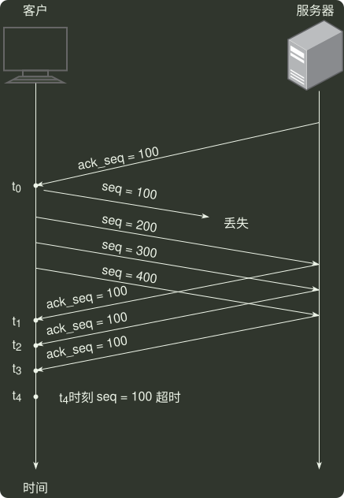

# q38_计算机网络

## 📋 题目要求 (题面)

某客户通过一个 TCP 连接向服务器发送数据的部分过程如题 38 图所示。客户在
 $t_{0}$
时刻第一次收到确认序列号 ack_seq=100 的段，并发送序列号 seq=100 的段，但发生丢失。若 TCP 支持快速重传，则客户重新发送 seq=100 段的时刻是（ ）。

- **A.** $t_{1}$
- **B.** $t_{2}$
- **C.** $t_{3}$
- **D.** $t_{4}$

---

## 💡 答案与深度解析

**【正确答案】**：`C`

**正确答案：C**
TCP 规定当发送方收到对同一个报文段的 3 个重复的确认时，就可以认为跟在这个被确认报文段之后的报文已经丢失，立即执行 快速重传 算法。t3 时刻连续收到了来自服务器的三个确认序列号 ack_seq = 100 的段。发送方认为 seq = 100 的段已经丢失，执行快速重传算法，重新发送 seq = 100 段。
