# q42_数据结构

## 📋 题目要求 (题面)

请设计一个队列，要求满足：

① 初始时队列为空；

② 入队时，允许增加队列占用空间；

③ 出队后，出队元素所占用的空间可重复使用，即整个队列所占用的空间只增不减；

④ 入队操作和出队操作的时间复杂度始终保持为 O(1) 。

请回答下列问题：

(1) 该队列是应选择链式存储结构，还是应选择顺序存储结构？

(2) 画出队列的初始状态，并给出判断队空和队满的条件。

(3) 画出第一个元素入队后的队列状态。

(4) 给出入队操作和出队操作的基本过程。

---

## 💡 答案与深度解析

1）顺序存储无法满足要求②的队列占用空间随着入队操作而增加。根据要求来分析：要求①容易满足；链式存储方便开辟新空间，要求②容易满足；对于要求③，出队后的结点并不真正释放，用队头指针指向新的队头结点，新元素入队时，有空余结点则无须开辟新空间，赋值到队尾后的第一个空结点即可，然后用队尾指针指向新的队尾结点，这就需要设计成一个首尾相接的循环单链表，类似于循环队列的思想。设置队头、队尾指针后，链式队列的入队操作和出队操作的时间复杂度均为 O(1)，要求④可以满足。因此，采用链式存储结构（两段式单向循环链表），队头指针为 front，队尾指针为 rear。

2）该循环链式队列的实现，可以参考循环队列，不同之处在于循环链式队列可以方便增加空间，出队的结点可以循环利用，入队时空间不够也可以动态增加。同样，循环链式队列也要区分队满和队空的情况，这里参考循环队列牺牲一个单元来判断。初始时，创建只有一个空闲结点的循环单链表，头指针 front 和尾指针 rear 均指向空闲结点，如下图所示。

front
