# q04_数据结构

## 📋 题目要求 (题面)

已知森林 F 及与之对应的二叉树 T，若 F 的先根遍历序列是 `a,b,c,d,e,f`，中根遍历序列是 `b,a,d,f,e,c`，则 T 的后根遍历序列是（ ）。

- **A.** b,a,d,f,e,c
- **B.** b,d,f,e,c,a
- **C.** b,f,e,d,c,a
- **D.** f,e,d,c,b,a

---

## 💡 答案与深度解析

**【正确答案】**：`C`

**正确答案：C**

本题考察的是 森林的遍历，
森林 F 的先根遍历序列对应其二叉树 T 的先序遍历序列，森林 F 的中根遍历序列对应其二叉树 T 的中序遍历序列。即 T 的先序遍历序列为 a,b,c,d,e,f，中序遍历序列为 b,a,d,f,e,c。根据二叉树 T 的先序序列和中序序列可以唯一确定它的结构，构造过程如下：

a
