# q05_数据结构

## 📋 题目要求 (题面)

下列给定的关键字输入序列中，不能生成如下二叉排序树的是（ ）。

- **A.** 4，5，2，1，3
- **B.** 4，5，1，2，3
- **C.** 4，2，5，3，1
- **D.** 4，2，1，3，5

---

## 💡 答案与深度解析

**【正确答案】**：`B`

**正确答案：B**

选项 B 生成二叉排序树的过程如下，显然 B 选项错误：

4
