# q07_数据结构

## 📋 题目要求 (题面)

已知无向图 G 如下所示，使用克鲁斯卡尔（Kruskal）算法求图 G 的最小生成树，加入到最小生成树中的边依次是（ ）。

- **A.** (b,f)(b,d)(a,e)(c,e)(b,e)
- **B.** (b,f)(b,d)(b,e)(a,e)(e,c)
- **C.** (a,e)(b,e)(c,e)(b,d)(b,f)
- **D.** (a,e)(c,e)(b,e)(b,f)(b,d)

---

## 💡 答案与深度解析

**【正确答案】**：`A`

**正确答案：A**

kruskal 算法 依次将当前 不会导致环路的最短边 加入最小生成树中：

a
