# q10_数据结构

## 📋 题目要求 (题面)

依次将关键字 5, 6, 9, 13, 8, 2, 12, 15 插入初始为空的 4 阶 B 树后, 根节点中包含的关键字是（ ）。

- **A.** 8
- **B.** 6, 9
- **C.** 8, 13
- **D.** 9, 12

---

## 💡 答案与深度解析

**【正确答案】**：`B`

**正确答案：B**

一 个 4 阶 B 树 的任意非叶结点至多含有加 4-1=3 个关键字，在关键字依次插入的过程中，会导致结点的不断分裂，插入过程如下所示。

5    6    9
