# q33_计算机网络

## 📋 题目要求 (题面)

下图描述的协议要素是 (  )。

Ⅰ、语法；Ⅱ、语义；Ⅲ、时序

- **A.** 仅 Ⅰ；
- **B.** 仅 Ⅱ；
- **C.** 仅 Ⅲ；
- **D.** Ⅰ、Ⅱ、Ⅲ

---

## 💡 答案与深度解析

**【正确答案】**：`C`

**正确答案：C**

本题考查 网络协议要素。协议 由语法、语义和时序（又称同步）三部分组成：

**语法** 规定了通信双方彼此“如何讲”，即规定了传输数据的格式。**语义** 规定了通信双方彼此“讲什么”，规定了所要完成的功能，如通信双方要发出什么控制信息、执行的动作和返回的应答。**时序** 规定了信息交流的次序。

由图可知发送方与接收方依次交换信息，体现了协议三要素中的时序要素。
