# q35_计算机网络

## 📋 题目要求 (题面)

下图所示的网络冲突域和广播域的个数分别是（ ）。

- **A.** 2，2；
- **B.** 2，4；
- **C.** 4，2；
- **D.** 4，4；

---

## 💡 答案与深度解析

**【正确答案】**：`C`

**正确答案：C**
参考网络设备总结：
网络层设备路由器可以隔离广播域和冲突域；链路层设备普通交换机只能隔离冲突域；物
理层设备集线器、中继器既不能隔离冲突域又不能隔离广播域。因此，题中共有 2 个广播
域、4 个冲突域。
