# q37_计算机网络

## 📋 题目要求 (题面)

某 IEEE 802.11 无线局域网中主机 H 与 AP 之间发送或接收 CSMA/CA 帧的过程如下图所示，在 H 或 AP 发送帧前所等待的帧间间隔时间（IFS）中最长的是（ ）。

- **A.** IFS1;
- **B.** IFS2;
- **C.** IFS3;
- **D.** IFS4；

---

## 💡 答案与深度解析

**【正确答案】**：`A`

**正确答案：A**

为了尽量避免碰撞，IEEE 802.11 规定，所有站在完成发送后，必须等待一段很短的时间（继续
监听）才能发送下一帧。这段时间称为帧间间隔（InterFrame Space, IFS）。帧间间隔的长
短取决于该站要发送的帧的类型。IEEE 802.11 使 用 3 种帧间间隔：

DIFS（分布式协调 IFS）：最长的 IFS , 优先级最低，用于异步帧竞争访问的时延。PIFS（点协调 IFS）：中等长度的 IFS , 优先级居中，在 PC F 操作中使用。SIFS（短 IFS）：最短的 IFS , 优先级最高，用于需要立即响应的操作。

网络中的控制帧及所接收数据的确认帧都采用 SIFS 作为发送之前的等待时延。当结点要发
送数据帧时，载波监听到信道空闲时，需等待 DIFS 后发送 RTS 预约信道，图中 IFS1 对应
的是帧间间隔 DIFS，时间最长，图中 IFS2、IFS3、IFS4 对应 SIFS。
