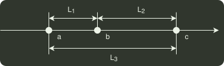

# q41_数据结构

## 📋 题目要求 (题面)

定义三元组
 $(a,b,c)$
（
 $a,b,c$
均为正数）的距离
 $D=∣a−b∣+∣b−c∣+∣c−a∣$
。给定
 $3$
个非空整数集合
 $S_{1}$ ,S2,S3
，按升序分别存储在
 $3$
个数组中。请设计一个尽可能高效的算法，计算并输出所有可能的三元组
 $(a,b,c)$
（
 $a∈S_{1}$ ,b∈S2,c∈S3
）中的最小距离。例如
 $S_{1}$ ={−1,0,9},S2={−25,−10,10,11},S3={2,9,17,30,41}
。则最小距离为
 $2$
，相应的三元组为
 $(9,10,9)$
。

要求：

（1）给出算法的基本设计思想；

（2）根据设计思想，采用 C 或 C++ 语言描述算法，关键之处给出注释；

（3）说明你所设计算法的时间复杂度和空间复杂度

---

## 💡 答案与深度解析

分析，由
 $D=∣a−b∣+∣b−c∣+∣c−a∣\ge 0$
得：

① 当
 $a=b=c$
时，距离最小。

② 其余情况。不失一般性，假设观察下面的数轴：
