# q06_数据结构

## 📋 题目要求 (题面)

给定平衡二叉树如下图所示，插入关键字 23 后，根中的关键字是（ ）。

- **A.** 16
- **B.** 20
- **C.** 23
- **D.** 25




---

## 💡 答案与深度解析

**【正确答案】**：`D`

**正确答案：D**

根据 AVL 旋转方法 可知，这题采用 RL 型旋转，旋转后树的结构为：

```c
25
   /  \
  20   30
 /  \    \
16  23    40
```

根结点为 25
