# q08_数据结构

## 📋 题目要求 (题面)

使用 Dijkstra 算法求下图中从顶点 1 到其余各顶点的最短路径，将当前找到的从顶点 1 到顶点 2, 3, 4, 5 的最短路径长保存在数组 dist 中，求出第二条最短路径后，dist 中的内容更新为（ ）

- **A.** 26, 3, 14, 6
- **B.** 25, 3, 14, 6
- **C.** 21, 3, 14, 6
- **D.** 15, 3, 14, 6

---

## 💡 答案与深度解析

**【正确答案】**：`C`

**正确答案：C**
在 dijkstra 算法 中，每次在 dist 数组中选择一个最小值加入顶点集，并从该顶点出发修改 dist 数组。本题中 dist 数组的变化过程如下：
`dist[26, 3, ∞, 6] → [25, 3, ∞, 6] → [21, 3, 14, 6]`
