# q11_计算机组成原理

## 📋 题目要求 (题面)

将关键字 6, 9, 1, 5, 8, 4, 7 依次插入到初始为空的大根堆 H 中，得到的 H 是（  ）。

- **A.** 9, 8, 7, 6, 5, 4, 1
- **B.** 9, 8, 7, 5, 6, 1, 4
- **C.** 9, 8, 7, 5, 6, 4, 1
- **D.** 9, 6, 7, 5, 8, 4, 1

---

## 💡 答案与深度解析

**【正确答案】**：`B`

**正确答案：B**

参考 构造初始堆 的过程：

6
