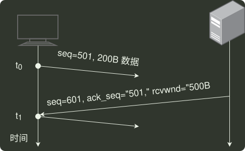

# q40_计算机网络

## 📋 题目要求 (题面)

设主机甲通过 TCP 向主机乙发送数据，部分过程如下图所示。甲在
 $t_{0}$
时刻发送一个序号 seq=501、封装 200B 数据的段，在
 $t_{1}$
时刻收到乙发送的序号 seq = 601、确认序号 ack_seq = 501、接收窗口 rcvwnd = 500B 的段，则甲在未收到新的确认段之前，可以继续向乙发送的数据序号范围是（ ）。

- **A.** 501 ~ 1000
- **B.** 601 ~ 1100
- **C.** 701 ~ 1000
- **D.** 801 ~ 1100

---

## 💡 答案与深度解析

**【正确答案】**：`C`

**正确答案：C**
本题考察 TCP 的滑动窗口机制。
依题意，甲发送完 200B 报文后，继续发送的报文段中序号字段 seq=701。由于乙告知接收窗口为 500，且甲未收到乙对 seq =501 报文段的确认，那么甲还能发送的报文段字节数为 500-200=300B，因此甲在未收到新的确认段之前，还能发送的数据序号范围是 701~1000。
