# q03_数据结构

## 📋 题目要求 (题面)

若结点 p 与 q 在二叉树 T 的中序遍历序列中相邻，且 p 在 q 之前，则下列 p 与 q 的关系中，不可能的是（ ）。

I. q 是 p 的双亲

II. q 是 p 的右孩子

III. q 是 p 的右兄弟

IV. q 是 p 的双亲的双亲

- **A.** 仅 I
- **B.** 仅 III
- **C.** 仅 II、III
- **D.** 仅 II、IV

---

## 💡 答案与深度解析

**【正确答案】**：`B`

**正确答案：B**

对于此类题，每种情况只需举出一个反例即可。如图 1 所示，q 是 p 的双亲，中
序遍历序列为 {p, q}，I 可能。如图 2 所示，q 是 p 的右孩子，中序遍历序列为 {p, q}，Ⅱ可能。
如图 4 所示，q 是 p 的双亲的双亲，中序遍历序列为 {x, p, q}，IV 可能。如图 3 所示，q 是 p
的右兄弟，F 是 q 和 p 的父结点，中序遍历要求先遍历左子树，再访问根结点，最后遍历右
子树，因此一定先访问 p，再访问 F，最后访问 q，p 和 q 不可能相邻出现，II 不可能。

p
