# q05_数据结构

## 📋 题目要求 (题面)

对任意给定的含 n (n > 2) 个字符的有限集 S, 用二叉树表示 S 的哈夫曼编码集和定长编码集，分别得到二叉树 T1 和 T2。下列叙述中，正确的是 ( )。

- **A.** T1 与 T2 的结点数相同
- **B.** T1 的高度大于 T2 的高度
- **C.** 出现频次不同的字符在 T1 中处于不同的层
- **D.** 出现频次不同的字符在 T2 中处于相同的层

---

## 💡 答案与深度解析

**【正确答案】**：`D`

**正确答案：D**

可以画一个简单的特例来证明。图 1 是满足条件的二叉树 T1，图 2 是满足条件的二叉树 T2，结点中有值表示这个结点是编码字符。T1 和 T2 的结点数不同，A 错误。T1 的高度等于 T2 的高度，B 错误。出现频次不同的字符在 T1 中也可能处于相同的层，C 错误。对于定长编码码集，所有字符一定都在 T2 中处于相同的层，而且都是叶子结点。

3
