# q06_数据结构

## 📋 题目要求 (题面)

对于无向图 G=(V,E)，下列选项中，正确的是（  ）。

- **A.** 当 |V| ＞|E| 时，G 一定是连通的
- **B.** 当 |V| < |E| 时，G 一定是连通的
- **C.** 当 |V| = |E|-1 时，G 一定是不连通的
- **D.** 当 |V| > |E|+1 时，G 一定是不连通的

---

## 💡 答案与深度解析

**【正确答案】**：`D`

**正确答案：D**

注意，E 是图的边数，V 是图的顶点数。A 和 B 明显错误，如图 1 所示，|V| < |E|，但图 G 不连通；如图 2 所示，|V| > |E|，但图 G 不连通。如图 3 所示，在无向图中至少要有 |V| - 1 个顶点才可能连通，顶点数小于 |V| - 1 一定不可能连通，C 错误，D 正确。

图 1
