# q07_数据结构

## 📋 题目要求 (题面)

下图是一个有 10 个活动的 AOE 网，时间余量最大的活动是 ( )。

- **A.** c
- **B.** g
- **C.** h
- **D.** j

---

## 💡 答案与深度解析

**【正确答案】**：`B`

**正确答案：B**

在 AOE 网中，活动的时间余量 = 结束顶点的最迟开始时间 - 开始顶点的最早开始时间 - 该活动的持续时间。根据关键路径算法得到下表：

| 结点编号 | 1 | 2 | 3 | 4 | 5 | 6 |
| --- | --- | --- | --- | --- | --- | --- |
| 最早开始时间 ve(i) | 0 | 2 | 5 | 8 | 9 | 12 |
| 最迟开始时间 vl(i) | 0 | 4 | 5 | 8 | 11 | 12 |

c 的时间余量 = vl(3) - ve(2) - 1 = 5 - 2 - 1 = 2g 的时间余量 = vl(6) - ve(3) - 1 = 12 - 5 - 1 = 6，h 的时间余量 = vl(5) - ve(4) - 1 = 11 - 8 - 1 = 2j 的时间余量 = vl(6) - ve(5) - 1 = 12 - 9 - 1 = 2，

时间余量最大的活动是 g。
