# q19_计算机组成原理

## 📋 题目要求 (题面)

设计某指令系统时，假设采用 16 位定长指令字格式，操作码使用扩展编码方式，地址码为 6 位，包含零地址、一地址和二地址 3 种格式的指令。若二地址指令有 12 条，一地址指令有 254 条，则零地址指令的条数最多为（ ）。

- **A.** 0
- **B.** 2
- **C.** 64
- **D.** 128

---

## 💡 答案与深度解析

**【正确答案】**：`D`

**正确答案：D**

本题考察 N 地址指令
如下图所示：零地址指令的 OP 字段位数相比一地址和二地址指令更短，但是需要注意的是，零地址指令的 OP 字段前缀与一地址和二地址指令的 OP 字段不能相同。

OP
