# q36_计算机网络

## 📋 题目要求 (题面)

下图所示网络中的主机 H 的子网掩码与默认网关分别是（ ）。

- **A.** 255.255.255.192, 192.168.1.1
- **B.** 255.255.255.192, 192.168.1.62
- **C.** 255.255.255.224, 192.168.1.1
- **D.** 255.255.255.224, 192.168.1.62

---

## 💡 答案与深度解析

**【正确答案】**：`D`

**正确答案：D**
默认网关 可以理解为离当前主机最近的路由器的端口地址，所以是 192.168.1.62，
而该主机的子网掩码和网关的子网掩码也相同，/27 即为 255.255.255.224。
