# q41_数据结构

## 📋 题目要求 (题面)

已知非空二叉树 T 的结点值均为正整数，采用顺序存储方式保存，数据结构定义如下：

```c
typedef struct {                    // MAX_SIZE 为已定义常量
    Elemtype SqBiTNode[MAX_SIZE];   // 保存二叉树结点值的数组
    int ElemNum;                    // 实际占用的数组元素个数
}SqBiTree;
```

T 中不存在的结点在数组 SqBiTNode 中用 -1 表示。例如，对于下图所示的两棵非空二叉树 T1 和 T2：

T1 的存储结果如下：

T2 的存储结果如下：

请设计一个尽可能高效的算法，判定一棵采用这种方式存储的二叉树是否为二叉搜索树，若是，则返回 true，否则，返回 false，要求：

(1) 给出算法的基本设计思想。

(2) 根据设计思想，采用 C 或 C++ 语言描述算法，关键之处给出注释。




---

## 💡 答案与深度解析

1）算法的基本设计思想

对于采用顺序存储方式保存的二叉树，根结点保存在 `SqBiTNode[0]` 中：当某结点保存在 `SqBiTNode[i]` 中时，若有左孩子，则其值保存在 `SqBiTNode[2i+1]`中；若有右孩子，则其值保存在 `SqBiTNode[2i+2]` 中；若有双亲结点，则其值保存在 `SqBiTNode[(i-1)/2]` 中。

二叉搜索树需要满足的条件是：任一结点值大于其左子树中的全部结点值，小于其右子树中的全部结点值。中序遍历二叉搜索树得到一个升序序列。

使用整型变量 `val` 记录中序遍历过程中已遍历结点的最大值，初值为一个负整数，对二叉树进行中序遍历。若当前遍历的结点值小于等于 `val`，则算法返回 false，否则，将 `val` 的值更新为当前结点的值。

2）算法实现

```c
// val 存储中序遍历中访问到的最大值
// 返回值：当前子树是否为 BST
bool solve(SqBiTree *tree, int k, int *val) {
  if (k >= tree->ElemNum) {
    // 空结点
    return true;
  }
  // 判断左子树是否为 BST
  bool ret = solve(tree, 2*k+1, val);
  if (!ret) {
    return false;
  }
  int cur_val = tree->SqbiTNode[k];
  if (cur_val == -1) {
    // 空结点
    return true;
  }
  // 判断中序序列是否递增
  if (cur_val > *val) {
    *val = cur_val;
  } else {
    return false;
  }
  // 判断右子树是否为 BST
  ret = solve(tree, 2*k+2, val);
  if (!ret) {
    return false;
  }
  return true;
}
```
