# q43_计算机组成原理

## 📋 题目要求 (题面)

某 CPU 中部分数据通路如图所示，其中，GPRs 为通用寄存器组；FR 为标志寄存器，用于存放 ALU 产生的标志信息；带箭头虚线表示控制信号，如控制信号 ReaD. Write 分别表示主存读、主存写，MDRin 表示内部总线上数据写入 MDR，MDRout 表示 MDR 的内容送内部总线。

(1) ALU 的输入端 A. B 及输出端 F 的最高位分别为 A15 、 B15 及 F15 ，FR 中的符号标志和溢出标志分别为 SF 和 OF，则 SF 的逻辑表达式是什么？A 加 B. A 减 B 时 OF 的逻辑表达式分别是什么？要求逻辑表达式的输入变量为 A15、B15 及 F15 。

(2) 为什么要设置暂存器 Y 和 Z？

(3) 若 GPRs 的输入端 rs、rd 分别为所读、写的通用寄存器的编号，则 GPRs 中最多有多少个通用寄存器？rs 和 rd 来自图中的哪个寄存器？已知 GPRs 内部有一个地址译码器和一个多路选择器，rd 应该连接地址译码器还是多路选择器？

(4) 取指令阶段（不考虑 PC 增量操作）的控制信号序列是什么？若从发出主存读命令到主存读出数据并传送到 MDR 共需 5 个时钟周期，则取指令阶段至少需要几个时钟周期？

(5) 图中控制信号由什么部件产生？图中哪些寄存器的输出信号会连到该部件的输入端？

---

## 💡 答案与深度解析

1）符号标志 SF 表示运算结果的正负性，因此
 $SF=F_{15}$

对于加法运算
 $A+B→F$
，若
 $A$
、
 $B$
为负，且
 $F$
为正，则说明发生溢出：或者，若
 $A$
、
 $B$
为正，
且
 $F$
为负，也说明发生溢出。因此，加运算时，溢出标志
 $OF=A_{15}$ ⋅B15⋅F15+A15⋅B15⋅F15
。

对于减法运算
 $A−B→F$
，若
 $A$
为负、
 $B$
为正，且
 $F$
为正，则说明发生溢出：或者，若
 $A$
为正、
 $B$
为负，且
 $F$
为负，也说明发生溢出。因此，减运算时，溢出标志
 $OF=A_{15}$ ⋅B15⋅F15+A15⋅B15⋅F15
。

2）因为在单总线结构中，每一时刻总线上只有一个数据有效，而 ALU 有两个输入端和一个
输出端。因此，当 ALU 运算时，需要先用暂存器 Y 缓存其中一个输入端的数据，再通过
总线传送另一个输入端的数据。与此同时，ALU 的输出端产生运算结果，但由于总线正
被占用，因此需要暂存器 Z，以缓存 ALU 的输出端数据。

3）由图可知，rs 和 rd 都是 4bit，因此 GPRs 中最多有
 $24$ =16
个通用寄存器；rs 和 rd 来自指令寄
存器 IR；rd 表示寄存器编号，应连接地址译码器。

4）取指阶段需要根据程序计数器 PC 取出主存中的指令，并将指令写入指令寄存器 R 中。控制
信号序列如下：

①PCout,MARin // 将指令的地址写入 MAR

②Read // 读主存，并将读出的数据写入 MDR

③MDRout,Rin // 将 MDR 的内容写入指令寄存器 R

步骤①需要 1 个时钟周期，步骤②需要 5 个时钟周期，步骤③需要 1 个时钟周期，因此取指
令阶段至少需要 7 个时钟周期。

5）图中控制信号由控制部件（CU）产生。指令寄存器 IR 和标志寄存器 FR 的输出信号会连
到控制部件的输入端。
