# q04_数据结构

## 📋 题目要求 (题面)

在有 6 个字符组成的字符集 S 中，各个字符出现的频次分别为 3, 4, 5, 6, 8, 10，为 S 构造的哈夫曼树的加权平均长度为（ ）

- **A.** 2.4
- **B.** 2.5
- **C.** 2.67
- **D.** 2.75

---

## 💡 答案与深度解析

**【正确答案】**：`B`

**正确答案：B**

计算字符集 S 构造的 哈夫曼编码 的 加权路径长度，我们需要使用字符的频次来确定每个字符的编码长度，并计算加权平均值。给定字符集 S 中各字符出现的频次为 3，4，5，6，8，10，我们可以按照哈夫曼编码算法构造哈夫曼树。构建的哈夫曼树如图所示。加权平均长度 =（编码长度 1 × 频次 1 + 编码长度 2 × 频次 2 + &mldr; + 编码长度 n × 频次 n）/（频次 1 + 频次 2 + … + 频次 n），在本题中，加权平均长度=((3+4+5+6)×3 + (8+10)×2)/(3+4+5+6+8+10)=2.5。本题答案选 B。

36
